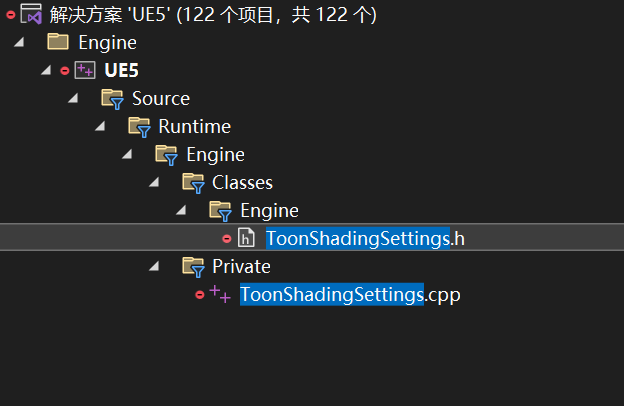
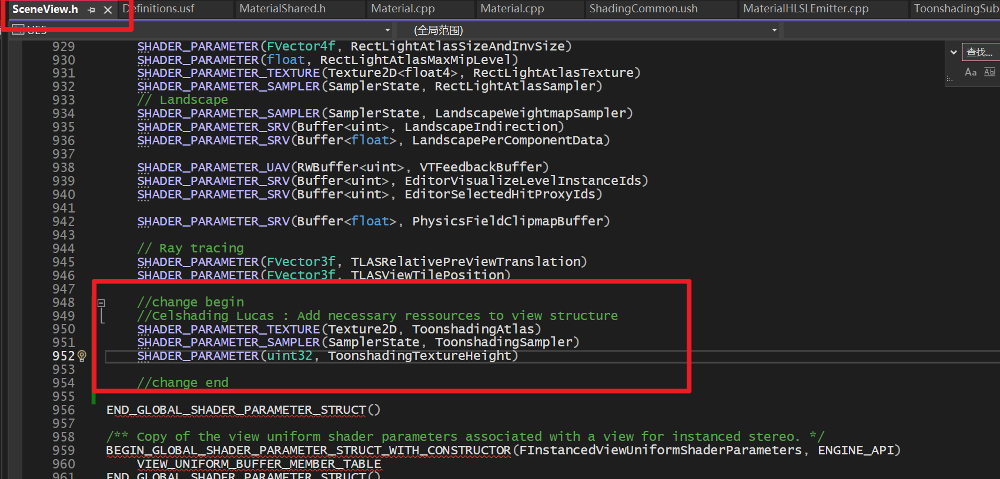
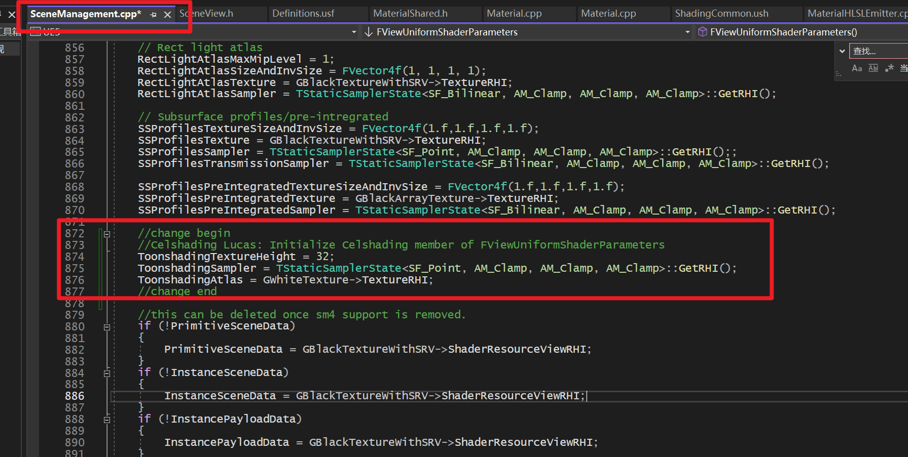
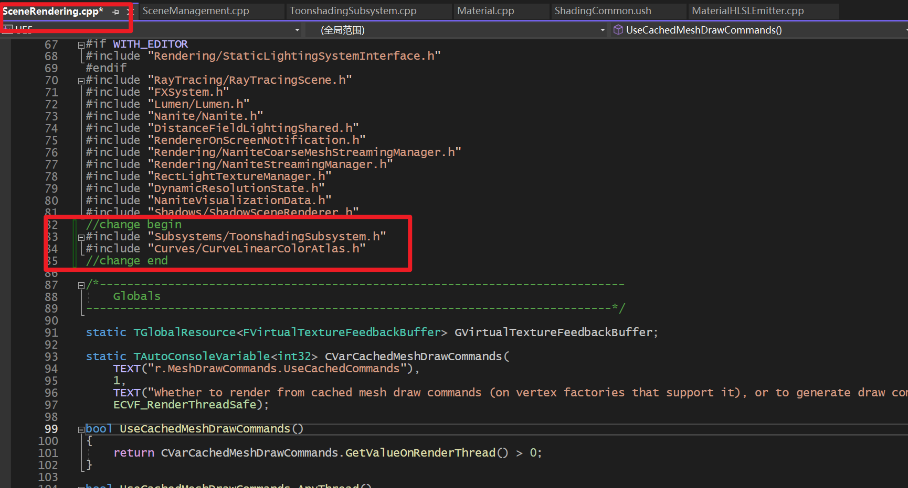
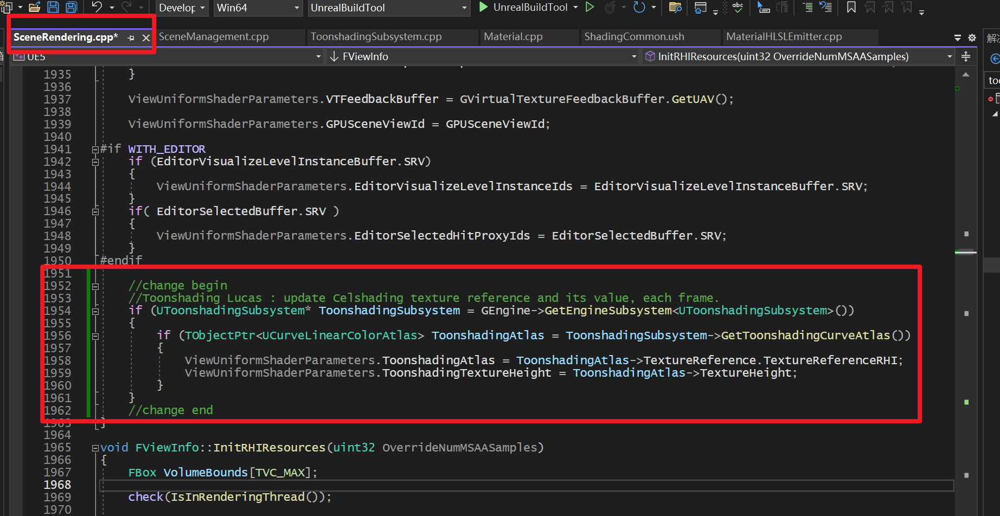
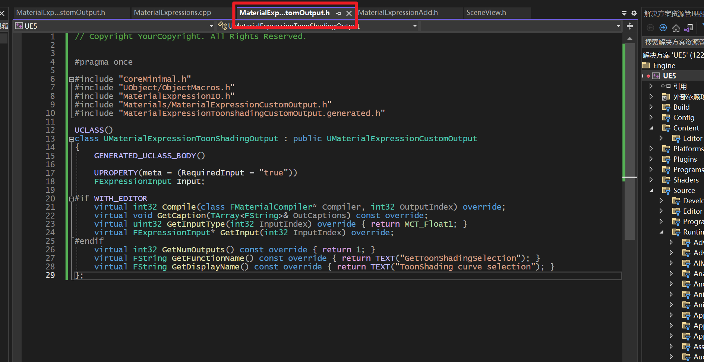

# 管线改造日记

## 0.开始尝试（Follow Epic教程）

- 将Toon Lit和Toon Hair这两个Shading Model所需的Ramp曲线打包进linear color atlas，然后添加进引擎的Content文件夹
- 实现打开引擎时自动从Engine/Content加载atlas，用于base pass计算。（也可以不这么搞）
  - 这么做的原因
    - 让每个项目都从引擎内加载同样的atlas，避免同一张图连来连去。
    - 将atlas发送到RHI，base pass才能读取。
  - 这样做需要的步骤有
    - 添加继承自`UDeveloperSettings`类的`UToonSettings`类。
    - 添加`UToonSubsystem`用来加载和更新atlas（**不是线程安全的，目前感觉比较鸡肋，但就当学习了**
    - 在`SceneView.h`中创建texture、sampler之类的HLSL变量
    - 在`SceneManagement.cpp`中将创建的变量发送到RHI
    - 在`SceneRendering.cpp`中添加更新atlas时重新发送到RHI的逻辑
    - 将atlas写进新的G-buffer或CustomData0
      - 如果写进G-buffer
        - pros：可以使用多条curve
        - cons：写起来比较麻烦、移动端不支持、G-buffer scene texture只用一个通道比较浪费
      - 而且昨天的工作中，已经搞好了CustomData0。所以选择写进CustomData0
    - 创建custom材质节点用来获取输入或者输出。

### 一.添加`ToonShadingSettings.h`和`ToonShadingSettings.cpp`



#### 1.添加.h

`ToonShadingSettings.h`在`Engine/Source/Runtime/Engine/Classes/Engine`

```c++

// Copyright YourCopyright. All Rights Reserved.

#pragma once
//引用部分，本类是继承自DeveloperSettings.h，继承后可以在项目设置菜单里面自动注册
#include "CoreMinimal.h"
#include "UObject/ObjectMacros.h"
#include "Engine/DeveloperSettings.h"

#include "ToonshadingSettings.generated.h"

//添加后文所需的Color Atlas
class UCurveLinearColorAtlas;

//config=Engine:将UCLASS定义为Engine Configuration，在DefaultEngine.ini中修改与它有关的配置
//defaultconfig:全局的config，所有项目共用同一个atlas。warning: 如果每个项目用不同的，要删掉
//DisplayName:选项在“ProjectSettings”菜单中的名字
UCLASS(config = Engine, defaultconfig, meta = (DisplayName = "Toonshading"))
class ENGINE_API UToonshadingSettings : public UDeveloperSettings
{
	GENERATED_UCLASS_BODY()

public:
    //config:UPROPERTY需要保存在ini中
	UPROPERTY(config, EditAnywhere, Category = General, meta = (DisplayName = "Toonshading curve atlas",
		ToolTip = "Linear color curve atlas used for Toonshading calculation.",
		ConfigRestartRequired = false))
    //soft reference，来引用我们所需要的atlas。打开菜单时不需要重新加载资产，所以用软引用。
	TSoftObjectPtr<UCurveLinearColorAtlas> ToonshadingCurveAtlas;

#if WITH_EDITOR
    //在编辑器中，每次更改UPROPERTY时，更新atlas。
	virtual void PostEditChangeProperty(FPropertyChangedEvent& PropertyChangedEvent) override;
#endif
};
```

#### 2.添加.cpp

`ToonShadingSettings.cpp`在`Engine/Source/Runtime/Engine/Private`

```c++
// Copyright YourCopyright. All Rights Reserved.

#include "Engine/ToonshadingSettings.h"
#include "Curves/CurveLinearColorAtlas.h"

//必须添加默认构造函数
UToonshadingSettings::UToonshadingSettings(const FObjectInitializer& ObjectInitializer)
	: Super(ObjectInitializer)
{

}

void UToonshadingSettings::PostEditChangeProperty(FPropertyChangedEvent& PropertyChangedEvent)
{
	Super::PostEditChangeProperty(PropertyChangedEvent);
	// 当property改变时
	if (PropertyChangedEvent.Property)
	{
		//如果它是我们此前定义的atlas property
		if (PropertyChangedEvent.GetPropertyName() == GET_MEMBER_NAME_CHECKED(UToonshadingSettings, ToonshadingCurveAtlas))
		{
			// 就对其进行重载
			UCurveLinearColorAtlas* ObjectAtlas = ToonshadingCurveAtlas.LoadSynchronous();
			if (ObjectAtlas)
			{
				//这里要写atlas更改后的逻辑，待完成。
			}
		}
	}
}
```

#### 3.修改`Engine/Config/BaseEngine.ini`

```
;添加

[/Script/Engine.ToonshadingSettings]
ToonshadingCurveAtlas=/Engine/ToonShading/ToonLitAtlas.ToonLitAtlas
```

下面的路径是atlas的引用路径，在资产中右键打开菜单可以Copy Reference。

### 二、添加Subsystem

我们需要加载并保存对`ToonLitAtlas`的引用。为此，我们使用引擎子系统。子系统的工作方式有点像经典的C++单例。但优点是它们的生命周期由引擎本身自动管理。子系统有不同类型的，变化主要是在创建和销毁时。有关此内容的更多信息，请查看维基。

#### 1.ToonshadingSubsystem.h

 (`Engine/Source/Runtime/Engine/Public/Subsystems/`)

```c++
#pragma once

#include "CoreMinimal.h"
#include "Subsystems/EngineSubsystem.h"
#include "ToonshadingSubsystem.generated.h"

class UCurveLinearColorAtlas;

//用来管理atlas更新的一个subsystem
UCLASS()
class ENGINE_API UToonshadingSubsystem : public UEngineSubsystem
{
	GENERATED_BODY()

public:
	//initialize & 加载atlas
	virtual void Initialize(FSubsystemCollectionBase& Collection) override;

	//subsystem生命结束时，垃圾回收用的
	virtual void Deinitialize() override;

	// atlas的getter
	TObjectPtr<UCurveLinearColorAtlas> GetToonshadingCurveAtlas() const;

	// 更新atlas的Reference
	void UpdateToonshadingCurveAtlas(UCurveLinearColorAtlas* InAtlas);

private:
	//atlas的TObjectPtr
	UPROPERTY()
	TObjectPtr<UCurveLinearColorAtlas> ToonshadingCurveAtlas;
};
```

注意：不能在子系统中创建原始 UPROPERTY 指针。它必须是 `TObjectPtr<>`。

#### 2.ToonshadingSubsystem.cpp

（`Engine/Source/Runtime/Engine/Private/Subsystems/`）

```c++
// Copyright YourCopyright. All Rights Reserved.

#include "Subsystems/ToonshadingSubsystem.h"
#include "Engine/ToonshadingSettings.h"
#include "Curves/CurveLinearColorAtlas.h"
//初始化
void UToonshadingSubsystem::Initialize(FSubsystemCollectionBase& Collection)
{
	Super::Initialize(Collection);

	//获取setting类
	const UToonshadingSettings* ToonshadingSettings = GetDefault<UToonshadingSettings>();

	//加载atlas
	ToonshadingCurveAtlas = ToonshadingSettings->ToonshadingCurveAtlas.LoadSynchronous();

	//加载失败时，Log
	if (!ToonshadingCurveAtlas)
	{
		UE_LOG(LogInit, Error, TEXT("Can't load Toonshading atlas, please check selected asset in project settings"));
	}
}

//销毁subsystem时
void UToonshadingSubsystem::Deinitialize()
{
	// Remove the reference count (not sure if it's useful for garbage collector)
	ToonshadingCurveAtlas = nullptr;
}
//更新atlas时的操作
void UToonshadingSubsystem::UpdateToonshadingCurveAtlas(UCurveLinearColorAtlas* InAtlas)
{
	// We could do more check here.
	ToonshadingCurveAtlas = InAtlas;
}
//get
TObjectPtr<UCurveLinearColorAtlas> UToonshadingSubsystem::GetToonshadingCurveAtlas() const
{
	return ToonshadingCurveAtlas;
}
```

#### 3.回到第一步中的ToonSetting.cpp中修改atlas更新后的逻辑

还记得第一步里面，有一个”待完成“吗？现在可以完成了~

更新后的ToonshadingSettings.h如下：

**记得include！！！！下面的文件没有include！！！编译出错了**

```c++
// Copyright YourCopyright. All Rights Reserved.

#include "Engine/ToonshadingSettings.h"
#include "Curves/CurveLinearColorAtlas.h"
#include "Subsystems/ToonshadingSubsystem.h" ///////////////////warning/////////////记得！！

UToonshadingSettings::UToonshadingSettings(const FObjectInitializer& ObjectInitializer)
	: Super(ObjectInitializer)
{

}

void UToonshadingSettings::PostEditChangeProperty(FPropertyChangedEvent& PropertyChangedEvent)
{
	Super::PostEditChangeProperty(PropertyChangedEvent);
	// If a property change
	if (PropertyChangedEvent.Property)
	{
		// If it's our Toonshading atlas
		if (PropertyChangedEvent.GetPropertyName() == GET_MEMBER_NAME_CHECKED(UToonshadingSettings, ToonshadingCurveAtlas))
		{
			// Try to load the Toonshading atlas and check if it's not nullptr
			UCurveLinearColorAtlas* ObjectAtlas = ToonshadingCurveAtlas.LoadSynchronous();
			if (ObjectAtlas)
			{
				// The logic after loading the new atlas
				UToonshadingSubsystem* ToonshadingSubsystem = GEngine->GetEngineSubsystem<UToonshadingSubsystem>();
				if (ToonshadingSubsystem)
				{
					ToonshadingSubsystem->UpdateToonshadingCurveAtlas(ObjectAtlas);
				}
			}
		}
	}
}
```

#### 4.编译

重要说明：如果像这里一样在引擎外部添加C++文件，则必须重新生成Visual Studio项目文件。这样做将更新UnrealBuildTool并创建与之关联的.generated.h文件。如果即使在那之后，您也因为缺少编译错误而收到一些编译错误，则可能需要删除engine Intermediate folder中的内容。（原教程是这么写的鼠标也是这么说的，但貌似不用）

### 三、将所需的变量发送到RHI

#### 1.SceneView.h



这一步是为了声明我们需要的Tex2D、sampler和atlas所需的height，使得HLSL能读到他们

#### 2.SceneManagement.cpp



这一步是为了初始化我们的东西并且发送到RHI。

We use the template to create a global sampler using **point sampling**, we have to use point sampling because bilinear blends pixels at top and down, so our lines blend into each other. We clamp because we don’t want values before 0 and after 1. Finally, we initialize the curve atlas with the global white texture.
我们使用模板通过点采样创建全局采样器，我们必须使用点采样，因为双线性混合顶部和下方的像素，因此我们的线相互混合。我们进行钳位，因为我们不希望 0 之前和 1 之后的值。最后，我们使用全局白色纹理初始化曲线图集。

#### 3.SceneRendering.cpp

首先include



然后添加语句



从Subsystem里面读取atlas和height，对其进行更新。

### 四、新建材质节点

#### 1.MaterialExpressionToonshadingCustomOutput.h

 Engine/Source/Runtime/Engine/Classes/Materials/MaterialExpressionToonshadingCustomOutput.h

可以抄这个文件夹下面别的文件。



首先，我们包括所有需要的依赖项。包括父类还有一些别的。

然后我们创建一个新的 UCLASS（），名为 UMaterialExpressionCelShadingOutput，它是类 UMaterialExpressionCustomOutput 的子级。UMaterialExpressionCustomOutput 是一个自动生成 HLSL getter 的类，非常好用。它将定义一个新函数并在其中添加您的数学逻辑。

然后，您可以在basepass中调用它，like any classic material pin。

#### 2.MaterialExpressions.cpp

上一步只是添加了.h，我们要在哪里实现它？UE5中所有节点都是在MaterialExpressions.cpp里面实现的，这个文件巨长，有25000行，我们在MaterialExpressions.cpp里include刚刚创建的.h再在后面添加实现即可。

**注意: 文件的最后一行有个undef宏，不要把代码粘在它下面了**

```c++
//构造函数
UMaterialExpressionToonShadingOutput::UMaterialExpressionToonShadingOutput(const FObjectInitializer& ObjectInitializer)
	: Super(ObjectInitializer)
{
#if WITH_EDITORONLY_DATA
	// Structure to hold one-time initialization
	struct FConstructorStatics
	{
		FText NAME_Utility;
		FConstructorStatics(const FString& DisplayName, const FString& FunctionName)
			: NAME_Utility(LOCTEXT("Utility", "Utility"))
		{
		}
	};
	static FConstructorStatics ConstructorStatics(GetDisplayName(), GetFunctionName());

	MenuCategories.Add(ConstructorStatics.NAME_Utility);

	bCollapsed = true;

	//我们不需要输出
	Outputs.Reset();
#endif
}

//编译
#if WITH_EDITOR
int32  UMaterialExpressionToonShadingOutput::Compile(class FMaterialCompiler* Compiler, int32 OutputIndex)
{
	if (Input.GetTracedInput().Expression)
	{
		return Compiler->CustomOutput(this, OutputIndex, Input.Compile(Compiler));
	}
	else
	{//没有输入则抛出错误
		return CompilerError(Compiler, TEXT("Curve selection is missing"));
	}
	return INDEX_NONE;
}

//节点名称
void UMaterialExpressionToonShadingOutput::GetCaption(TArray<FString>& OutCaptions) const
{
	OutCaptions.Add(FString(TEXT("Toonshading")));
}

//只是input的getter，我们只输入一个，所以只返回一个intput member就可以了。
FExpressionInput* UMaterialExpressionToonShadingOutput::GetInput(int32 InputIndex)
{
	return &Input;
}
#endif // WITH_EDITOR
//change end
```

