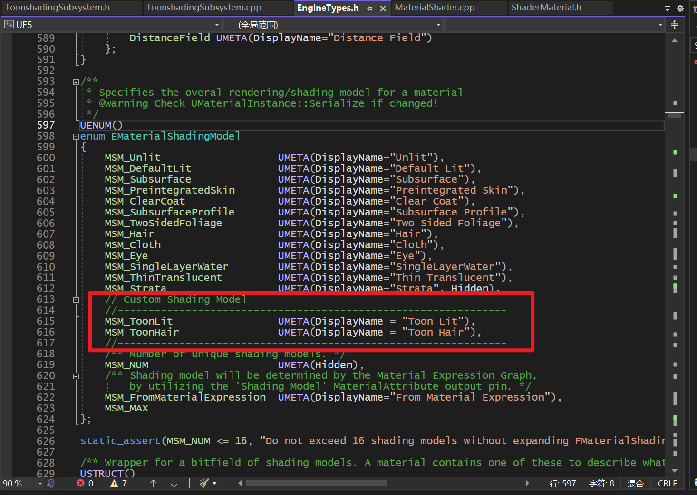

# 添加新ShadingModel的步骤

## 1. EngineTypes.h

首先最开始的最开始要在`enum EMaterialShadingModel`里面注册枚举类型，注意顺序，后面的很多设定也要保持这个顺序。

## 2.MaterialShader.cpp

第二步，是把刚刚在engineTypes.h里面声明的枚举类型和字符串对应起来。

这样好像可以得到更多统计数据？（我也不懂，比如指令数之类的吗？

（前面都是一些比较无聊的注册工作啦）

## 3. ShaderMaterial.h

这一步是为了后面申请GBuffer用的。

## 4.MaterialExpressionShadingModel.h

Material选shadingModel的地方，需要注册枚举

## 5.materialTranslator.png

同上，想在Material的下拉菜单中选择custom shading model就必须这么注册。

## 6.MaterialHLSLEmitter.cpp

在文件MaterialHLSLEmitter.cpp中还有另一个GetMaterialEnvironment（）函数，它看起来像上面一个的精确副本，所以也在那里添加我们的更改。

到这里扎不多就结束了，后面是GBuffer设置的部分。

## 7.Material.cpp

这一步是为了添加所需的引脚，Anistrophy、Tangent、Subsurface等

对于不透明度，它似乎是用MaterialShared.h的getterIsSubsurfaceShadingModel（）处理的。我们在其中添加了ToonLit和ToonHair

## 8.ShadingCommon.ush

来到hlsl侧，进行注册。

同一文件内，这个也要。颜色在editor view的缓冲-着色模型那里可以查看。

## 9.Definitions.usf

最后，在文件Definitions.usf中，我们将一些未定义的定义添加到0，因为Cg无法处理它们：

## 10.（可选）引脚重命名

