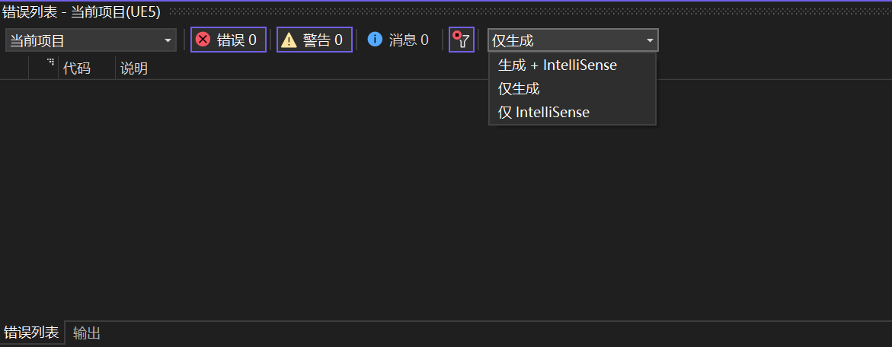

# 源码修改Tips

## 源码编译

注意.NET CORE 3.0和Runtime 6.0都要装，不然setup.bat不了

注意修改setup.bat中的cache位置，不然会挤爆C盘

## 添加cpp

别忘了include。。。

修改完任何cpp或.h都要重新编译。

## usf和ush

在material中点击apply即可编译单个material shader。

ctrl+shift+. 编译所有shader，如果想编译的shader是global shader的话，没办法，必须用这个。

## usf和ush调试

### 1. 用RenderDoc调试之前，记得在ini里面修改一些设置！

[New shading models and changing the GBuffer | Epic Developer Community --- 新的着色模型和更改 GBuffer |Epic开发者社区 (epicgames.com)](https://dev.epicgames.com/community/learning/tutorials/2R5x/unreal-engine-new-shading-models-and-changing-the-gbuffer)

这篇有讲。

## 报9000多个错

[Can someone please help me make a C++ class. I get 9000 errors every time I simply go into VS. : r/unrealengine --- 有人可以帮我上C++课吗？每次我简单地进入VS时，我都会收到9000个错误。： R/虚幻引擎 (reddit.com)](https://www.reddit.com/r/unrealengine/comments/h986yr/can_someone_please_help_me_make_a_c_class_i_get/?onetap_auto=true)

可能是因为调试窗口开的是生成+intellisense而不是仅生成。

itellisense比较傻。

## 损坏的映像

- 问题描述：
  - 改了一堆cpp以后，生成解决方案=>报错
  - 修改错误后，选择**生成**（而不是重新生成）,显示剩余项只有几百项，两三分钟就build成功了。build完打开UnrealEditor.exe，提示损坏的映像。

- 解决方法：
  - 重新生成解决方案。5000多项，等编译中。

# 无法保存

